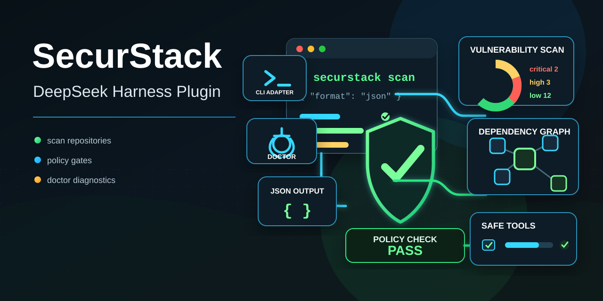

<p align="center">
  
</p>

# SecurStack DeepSeek Harness Plugin

DeepSeek Harness plugin for running SecurStack security checks directly from an AI-agent workflow.

The plugin registers safe, non-destructive Harness tools that call the official `securstack` CLI to scan repositories, return structured JSON results, run environment diagnostics, and evaluate scan output against repository policy gates. It lets DeepSeek Harness ask SecurStack what is risky, what is misconfigured, and whether a codebase passes policy without reimplementing SecurStack product logic inside the plugin.

This package is intentionally a thin adapter. It does not implement scan engines, encryption, upload logic, API contracts, or Shielding operations. Those responsibilities stay in `@securstack/cli` and the SecurStack SaaS.

## Capabilities

- Repository security scans via `securstack scan --format json`.
- Policy gates for CI-like pass/fail decisions with `securstack policy check`.
- Local setup and credential diagnostics through `securstack doctor`.
- Harness-friendly tool responses with parsed JSON where the CLI promises JSON output.
- Existing SecurStack authentication through `securstack login`, `SECURSTACK_API_KEY`, and `SECURSTACK_API_URL`.
- Adapter-only design that avoids destructive hooks, Shielding writes, or duplicated product contracts in v1.

## Requirements

- Node.js 20 or newer.
- DeepSeek Harness developer preview.
- SecurStack credentials configured with either:
  - `securstack login --api-key <key>`
  - `SECURSTACK_API_KEY` and optional `SECURSTACK_API_URL`

## Install

```bash
dsh plugin --profile securstack add @securstack/dsh-plugin
dsh --profile securstack
```

## Tools

- `securstack_scan`: runs `securstack scan --format json` for a repository path.
- `securstack_doctor`: runs `securstack doctor`.
- `securstack_policy_check`: runs `securstack policy check --input <scan.json>` with optional risk and severity limits.

## Examples

Ask DeepSeek Harness:

```text
Run a SecurStack scan on this repository and summarize critical findings.
```

```text
Check whether the last SecurStack scan passes the repository policy.
```

```text
Run SecurStack doctor and tell me what is misconfigured.
```

## Development

```bash
npm install
npm run build
npm test
npm pack --dry-run
```

For local Harness testing:

```bash
npm pack
dsh plugin --profile demo add ./securstack-dsh-plugin-0.1.0.tgz
dsh --profile demo --dump-config
```
